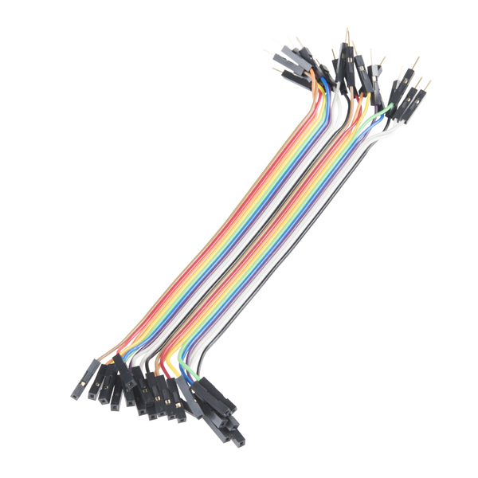

# Tutorial to recreate the Thirst-Alert system
## 1. Overview of the project
**Lucas Baunsgaard | lb224rw**

The ThirstAlert system uses a soil moisture sensor connected to an IoT platform to monitor and report the moisture levels in the soil. When the moisture level drops below a certain threshold, the system sends a notification to alert you that it's time to water your plants. This project is the result of an IoT course at Linnaeus University (LNU) in Sweden. Read more about the LNU course [Introduction to Applied Internet of Things.](https://lnu.se/kurs/tillampad-internet-of-things-introduktion/distans-internationell-engelska-sommar/)

***Time to complete:*** <br>
This took me approximately 8 hours to complete, but depending on your experience with IoT and electronics it might take shorter time.

## 2. Objective
### Project idea and purpose
The selection of this project was driven by a desire to explore the functionality of soil moisture sensors and their integration within a home automation system. The intention was to create a solution that bridges the gap between traditional plant care methods and modern IoT technologies. The project was chosen based on its potential to offer practical insights into the implementation of IoT devices in everyday scenarios.
<br>
The primary objective of this project is to develop a system capable of autonomously monitoring the soil moisture levels of plants and providing timely notifications for watering. The purpose is to establish an efficient and reliable method for plant care management that mitigates the risk of over or under-watering, thereby promoting plant health and longevity.
### Insights
Through the execution of this project, it is expected to gain valuable insights into the technical aspects of IoT device integration, sensor calibration, and data interpretation. Furthermore, the project aims to provide a deeper understanding of the role of technology in optimizing plant care routines. The anticipated insights encompass both practical knowledge related to hardware implementation and conceptual understanding of the synergy between IoT and agriculture.

## 3. Material
**Image** |**Component** | **Description/Function** | **Purchased From** | **Price** (approximately)
--------------|--------------| -------------------------| -------------------| ------------------------
 | Raspberry Pi Pico WH   | Serves as the central controller in the Thirst-Alert system. It processes data from the soil moisture sensor and sends notifications to alert when it's time to water the plants. The onboard WiFi module allows for seamless connectivity to the network, enabling remote monitoring and alerts.     |[Electrokit](https://www.electrokit.com/en/raspberry-pi-pico-wh)| 109 SEK
 | Soil hygrometer module          | The Soil Hygrometer Module detects soil moisture levels, providing crucial data for the Thirst-Alert system. It consists of two probes that are inserted into the soil, and its analog output varies depending on the moisture content. This module serves as the primary sensor, allowing the system to determine when watering is needed based on the soil's hydration level.     |[Electrokit](https://www.electrokit.com/en/jordfuktighetssensor)      | 29 SEK
 | temperature and humidity sensor | The DHT11 sensor measures environmental temperature and humidity, providing digital output for accurate monitoring of the plant's surroundings. Essential for ensuring optimal growing conditions. | [Electrokit](https://www.electrokit.com/en/digital-temperatur-och-fuktsensor-dht11) | 49 SEK
 | Solderless Breadboard | The Solderless Breadboard acts as the assembly platform for electronic circuits in the project. It allows easy and temporary connections of components without soldering, facilitating rapid prototyping and testing of the Thirst-Alert system's electronic setup.     |[Electrokit](https://www.electrokit.com/en/kopplingsdack-840-anslutningar)      | 69 SEK
 | Jumper wires female/male| These wires facilitate connections between components on the breadboard and other hardware, enabling seamless signal and power transmission in the project. |[Electrokit](https://www.electrokit.com/en/labbsladd-40-pin-30cm-hona/hane)| 49 SEK
 | Jumper wires male/male | These wires were used only on the breadboard and are therefore not really a necessary component for this build. I bought them for simplicity *(as you see in the final picture)*, but you can still do this project without them. | [Electrokit](https://www.electrokit.com/en/labbsladd-40-pin-30cm-hane/hane) | 49 SEK


## 4. Computer setup
### Chosen IDE
For this project, Visual Studio Code (VS Code) is used as the Integrated Development Environment (IDE). VS Code is a powerful and versatile editor with extensive support for various programming languages and tools.

### Installing Necessary Software
1. **Visual Studio Code**<br>
Download and install Visual Studio Code from the [official website](https://code.visualstudio.com/). Follow the installation instructions specific to your operating system.
3. **Node.js** <br>
Download and install Node.js from the [official website](https://nodejs.org/).<br> After installing it open command promt on your computer and write:
   ```shell
   node -v
   npm -v
   ```
   in the terminal to verify a successful installation

5. **Raspberry pi pico firmware**<br>
Download the latest firmware release on the [MycroPython site](https://micropython.org/download/RPI_PICO_W/). To install the firmware follow their guide they provide under **Installation instructions** on the same site as you downloaded the firmware.

### Setting Up The IDE
1. **Installing Extensions in Visual Studio Code**
   - To connect to the Raspberry Pi Pico WH board, you will need to add the [***Pymakr***](https://marketplace.visualstudio.com/items?itemName=pycom.Pymakr) extension by **Pycom**. If you're unsure how to add extensions, you can follow [this guide](https://code.visualstudio.com/docs/editor/extension-marketplace).
   - Additionally, I recommend downloading the [***Python***](https://marketplace.visualstudio.com/items?itemName=ms-python.python) extension by **Microsoft**, which enhances the Python programming experience in Visual Studio Code.
 
## 5. Putting everything together
 <br>

## 6. Platform
### Thingspeak:
For my project, I chose [ThingSpeak](https://thingspeak.com) as the platform for collecting, storing, and analyzing data. ThingSpeak is a cloud-based Internet of Things (IoT) platform provided by MathWorks, and its API works seamlessly with the Raspberry Pi Pico WH. The platform offers an easy method to store information on their cloud servers, which was crucial for my needs because I didn't want to store the data locally. The setup process was straightforward, and the platform's data visualization tools are both easy to use and visually pleasing. <br>

ThingSpeak's ability to create events based on specific data values was another key feature that influenced my decision. This functionality allows for real-time alerts when plant needs water, enhancing the project's interactivity and responsiveness. 

### Get started:
   1. To get started with Thingspeak you first need to have an <ins>MathWork</ins> account, you can follow the steps on their [website](https://www.mathworks.com).
   2. Login to Thingspeak and create a new channel under the "[Channels](https://thingspeak.com/channels)" menu

## 7. The code
### Wi-Fi function:
To connect your Raspberry Pi Pico WH board to the Wi-Fi, I created a function that is called within the `boot.py` file. You can use this function to establish the connection:
```Python
def connect():
    wlan = network.WLAN(network.STA_IF)         # Put modem on Station mode
    if not wlan.isconnected():                  # Check if already connected
        print('connecting to network...')
        wlan.active(True)                       # Activate network interface
        
        # set power mode to get WiFi power-saving off (if needed)
        wlan.config(pm = 0xa11140)
        wlan.connect(keys.WIFI_SSID, keys.WIFI_PASS)  # Your WiFi Credential
        print('Waiting for connection...', end='')

        # Check if it is connected otherwise wait
        while not wlan.isconnected() and wlan.status() >= 0:
            print('.', end='')
            sleep(1)

    # Print the IP assigned by router
    ip = wlan.ifconfig()[0]                # Get the IP address
    print('\nConnected on {}'.format(ip))  # Print the IP address
    return ip                              # Return the IP address
```
This function initializes the Wi-Fi interface in station mode, checks for an existing connection, and attempts to connect to the specified Wi-Fi network using credentials stored in keys.WIFI_SSID and keys.WIFI_PASS in the `keys.py` file. If successful, it prints and returns the assigned IP address.

### Wi-Fi connection test function
The http_get function performs a simple HTTP GET request to a specified URL, used in `boot.py` to check internet connectivity.
```Python
def http_get(url = 'http://detectportal.firefox.com/'):
    import socket                           # Used by HTML get request
    import time                             # Used for delay
    try:
        _, _, host, path = url.split('/', 3)    # Separate URL request
        addr = socket.getaddrinfo(host, 80)[0][-1]  # Get IP address of host
        s = socket.socket()                     # Initialise the socket
        s.connect(addr)                         # Try connecting to host address
        
        # Send HTTP request to the host with specific path
        s.send(bytes('GET /%s HTTP/1.0\r\nHost: %s\r\n\r\n' % (path, host), 'utf8'))    
        time.sleep(1)                           # Sleep for a second
        rec_bytes = s.recv(10000)               # Receve response
        print(rec_bytes)                        # Print the response
        s.close()                               # Close connection

    except Exception as e:                      # If connection fails
        print(f"An error occured: {e}")         # Print error message
```
This function parses the provided URL, retrieves the host's IP address, and initializes a socket connection. It sends an HTTP GET request, prints the response, and then closes the connection. Any errors during this process are caught and printed. This function verifies internet connectivity by attempting to reach a known URL.

### API connection test function
To ensure that the Raspberry Pi Pico WH board can communicate with the ThingSpeak API, another function is defined and called within the `boot.py` file. This function verifies the connection to the API by sending a test request.
```Python
def test_api_connection():
    url = f'https://api.thingspeak.com/update?api_key={keys.api_key}&field1=0'
    try:
        response = urequests.get(url)
        if response.status_code == 200:
            print('API connection successful')
            return True
        else:
            print('API connection failed with status code', response.status_code)
            return False
    except Exception as e:
        print('API connection failed with error: ', e)
        return False
```
This function constructs a test URL using the API key stored in keys.api_key and attempts to send a GET request to ThingSpeak. If the response status code is 200, it prints "API connection successful" and returns True. Otherwise, it prints the failure status code or error message and returns False.

### Sensor data reading and API transmission
The following code snippet serves to monitor the moisture level of soil using a sensor and transmit the data to ThingSpeak, an IoT platform, for further analysis and visualization.
```Python
soil = ADC(27) # Soil sensor connected to pin 27
min_moisture = 0
max_moisture = 65535

# Reading the moisture level from the soil sensor and converting it to a percentage value.
moisture = round((max_moisture - soil.read_u16()) * 130 / (max_moisture - min_moisture))

# Checking if the moisture level is within the range of 0 to 100
if 0 <= moisture <= 100:
    print("Moisture is {}%".format(moisture))
    
    # Sending the data to ThingSpeak using the API key and the moisture level
    url = f'https://api.thingspeak.com/update?api_key={keys.api_key}&field1={moisture}'
    response = urequests.get(url)
    response.close()
```
The code reads the moisture level from the soil sensor thats connected to pin 27 and converts it into a percentage. It then checks if the moisture level falls within the valid range of 0 to 100%. If the moisture level is valid, the data is transmitted to ThingSpeak through an API call. This code snippet aids in automating soil moisture monitoring, facilitating efficient data collection for agricultural or environmental applications.

## 8. Data Transmission and Connectivity
To transmit the data collected from the moisture and temperature sensors, the Thirst-Alert system utilizes ThingSpeak, an IoT platform. This integration with ThingSpeak enables seamless data transmission to the cloud, where the sensor readings are securely stored and can be accessed remotely. ThingSpeak provides robust features for real-time data visualization, analysis, and integration with other IoT applications, enhancing the monitoring capabilities of the Thirst-Alert system. With ThingSpeak, users can easily track and manage the moisture and temperature levels of their plants from anywhere, ensuring optimal growing conditions.

## 9. Presenting the data

## 10. The final design

